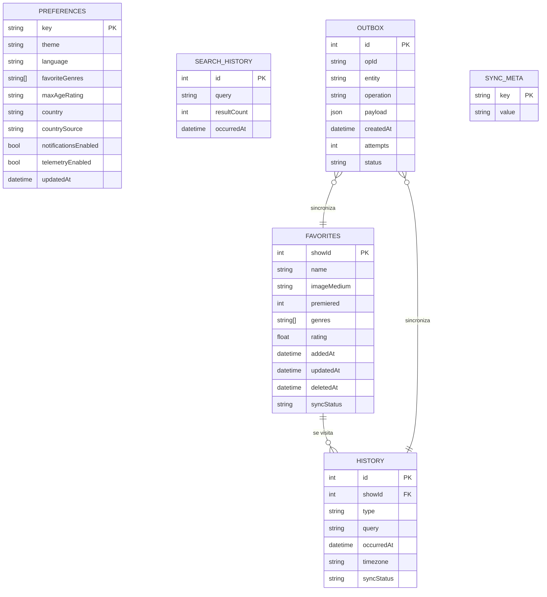
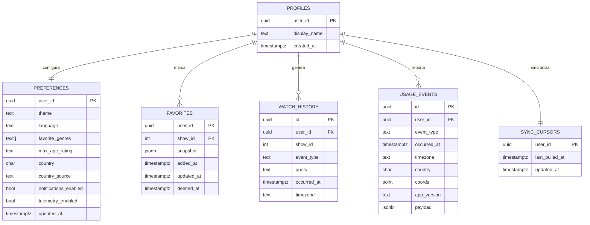

# Modelo de datos — Epix

Dos modelos complementarios: **local** (IndexedDB/Dexie, offline-first) y **externo**
(Supabase/PostgreSQL, multi-dispositivo y telemetría).

---

## 1. Modelo local (Dexie / IndexedDB)

### 1.1 Esquema de tablas

```js
// src/infrastructure/local/db.ts (referencia de Fase 2)
db.version(1).stores({
  preferences:  'key',
  favorites:    'showId, addedAt, syncStatus',
  history:      '++id, showId, type, occurredAt, syncStatus',
  searchHistory:'++id, query, occurredAt',
  outbox:       '++id, opId, entity, status, createdAt',
  syncMeta:     'key',
});
```

### 1.2 Entidades

| Tabla | Campo clave | Campos | Propósito |
| --- | --- | --- | --- |
| `preferences` | `key: 'app'` | `theme`, `language`, `favoriteGenres[]`, `maxAgeRating`, `country`, `countrySource`, `notificationsEnabled`, `telemetryEnabled`, `updatedAt`, `syncStatus` | Preferencias únicas del dispositivo |
| `favorites` | `showId` | `name`, `imageMedium`, `premiered`, `genres[]`, `rating`, `addedAt`, `updatedAt`, `deletedAt`, `syncStatus` | Favoritos con copia parcial de la serie (snapshot) |
| `history` | `++id` | `showId?`, `showName?`, `type: 'view'\|'search'\|'schedule_open'`, `query?`, `occurredAt`, `timezone`, `syncStatus` | Historial de uso local |
| `searchHistory` | `++id` | `query`, `resultCount`, `occurredAt` | Búsquedas recientes (atajos) |
| `outbox` | `++id` | `opId (uuid)`, `entity`, `entityId`, `operation: 'upsert'\|'delete'`, `payload`, `createdAt`, `attempts`, `lastAttemptAt`, `status: 'pending'\|'sent'\|'failed'` | Cola de sincronización |
| `syncMeta` | `key` | `value` | Cursores (`lastPulledAt`, `deviceId`) |

### 1.3 Diagrama



### 1.4 Criterios de decisión aplicados

| Dato | ¿Reconstruible? | ¿Crítico? | Almacén elegido | Motivo |
| --- | --- | --- | --- | --- |
| Resultados de búsqueda | Sí | No | TanStack Query (memoria) + Cache Storage | Temporal, se re-consulta |
| Imágenes de series | Sí | No | Cache Storage (`ExpirationPlugin`) | URLs inmutables, ahorro de datos |
| Favoritos / historial | No | Sí | IndexedDB (Dexie) + outbox | Deben sobrevivir offline y sincronizarse |
| Preferencias | No | Sí | IndexedDB + Supabase | Experiencia personal persistente |
| Telemetría pendiente | No | Media | IndexedDB (outbox) | No perder eventos sin red |

---

## 2. Modelo externo (Supabase / PostgreSQL)

### 2.1 Esquema

```sql
-- Perfil por usuario (identidad anónima o cuenta OTP; mismo auth.users.id)
create table public.profiles (
  user_id      uuid primary key references auth.users (id) on delete cascade,
  display_name text,
  created_at   timestamptz not null default now()
);

-- Preferencias (1:1 con el perfil)
create table public.preferences (
  user_id               uuid primary key references auth.users (id) on delete cascade,
  theme                 text not null default 'system',
  language              text not null default 'es',
  favorite_genres       text[] not null default '{}',
  max_age_rating        text not null default 'TV-14',
  country               char(2),
  country_source        text check (country_source in ('gps','manual')),
  notifications_enabled boolean not null default false,
  telemetry_enabled     boolean not null default false,
  updated_at            timestamptz not null default now()
);

-- Favoritos (n:1 con el perfil)
create table public.favorites (
  user_id    uuid not null references auth.users (id) on delete cascade,
  show_id    int  not null,
  snapshot   jsonb not null,              -- datos mínimos de la serie (TVmaze)
  added_at   timestamptz not null default now(),
  updated_at timestamptz not null default now(),
  deleted_at timestamptz,                 -- borrado lógico (permite sincronizar bajas)
  primary key (user_id, show_id)
);

-- Historial (append-only, idempotente por id de evento)
create table public.watch_history (
  id          uuid primary key,           -- generado en el cliente
  user_id     uuid not null references auth.users (id) on delete cascade,
  show_id     int,
  event_type  text not null,              -- view | search | schedule_open
  query       text,
  occurred_at timestamptz not null,
  timezone    text,
  created_at  timestamptz not null default now()
);

-- Telemetría de uso (mínimo necesario + consentimiento)
create table public.usage_events (
  id         uuid primary key,
  user_id    uuid not null references auth.users (id) on delete cascade,
  event_type text not null,               -- session_start | search | show_open | favorite_add | ...
  occurred_at timestamptz not null,
  timezone   text,
  country    char(2),
  coords     point,                       -- SOLO con consentimiento de ubicación + telemetría
  app_version text,
  payload    jsonb
);

-- Cursores de sincronización
create table public.sync_cursors (
  user_id        uuid primary key references auth.users (id) on delete cascade,
  last_pulled_at timestamptz not null default 'epoch',
  updated_at     timestamptz not null default now()
);
```

### 2.2 Seguridad (RLS)

- `alter table ... enable row level security;` en **todas** las tablas.
- Política uniforme por tabla: `using (auth.uid() = user_id)` para `select` / `update` / `delete`
  y `with check (auth.uid() = user_id)` para `insert`.
- El cliente solo usa la **anon key** con **auth anónima** (ampliable a cuentas OTP conservando el mismo `uid`, ADR-0010); la `service_role` nunca sale del servidor.
- "Mi actividad" permite `delete` de las filas propias (derecho al olvido, RNF-03).

### 2.3 Diagrama



---

## 3. Sincronización (mapa)

| Entidad | Dirección | Estrategia | Conflicto |
| --- | --- | --- | --- |
| `favorites` | ↔ bidireccional | Upsert idempotente + tombstones (`deleted_at`) | Last-write-wins por `updated_at` |
| `preferences` | ↔ bidireccional | Upsert por `user_id` | Last-write-wins |
| `history` / `usage_events` | → solo subida | Append-only por `id` UUID de cliente | No aplica (idempotente) |
| `watch_history` remoto | ← solo bajada (opcional) | Pull por `occurred_at` desde cursor | No aplica |

**Disparadores de sync:** evento `online`, apertura de la app, `Background Sync` (Chromium) y
acción manual en "Mi actividad". Reintentos con backoff exponencial y `maxRetentionTime` de 24 h.

## 4. Catálogo de eventos de telemetría

`session_start`, `session_end`, `screen_view`, `search` (query + nº resultados), `show_open`,
`episode_list_open`, `favorite_add`, `favorite_remove`, `filter_change`, `preference_change`,
`theme_change`, `gps_used`, `notification_permission`, `notification_shown`, `notification_open`,
`sync_success`, `sync_error`, `offline_start`, `offline_end`.

> Todos los eventos llevan `occurred_at` (ISO 8601 con zona horaria), `app_version` y, cuando
> aplica, `country` y `payload` específico. Las búsquedas se registran tal cual exige REQ-05,
> siempre bajo consentimiento (RF-11 / RNF-03).
